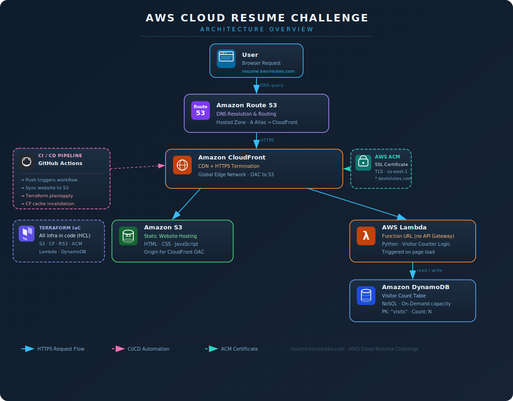

# ☁️ AWS Cloud Resume Challenge

A full-stack, cloud-native resume hosted entirely on AWS — built as part of the [Cloud Resume Challenge](https://cloudresumechallenge.dev/). In this project I demonstrate real-world cloud engineering skills including infrastructure as code, serverless backends, CI/CD automation, and secure HTTPS delivery.

🔗 **Live Site:** [resume.kevinlutes.com](https://resume.kevinlutes.com)

---

## 🏗️ Architecture Overview



---

## 🛠️ AWS Services Used

| Service | Purpose |
|---|---|
| **S3** | Hosts the static resume website (HTML/CSS/JS) |
| **CloudFront** | CDN for low-latency global delivery, origin security and HTTPS enforcement |
| **Route 53** | Custom domain (`resume.kevinlutes.com`) with DNS routing |
| **ACM** | SSL/TLS certificate for HTTPS on the custom domain |
| **Lambda** | Serverless function to read/write the visitor counter |
| **DynamoDB** | NoSQL table that stores the visitor count |

> **Note on Lambda Function URLs:** This project uses a Lambda Function URL instead of API Gateway to keep costs minimal and reduce architectural complexity. Lambda Function URLs provide a dedicated HTTPS endpoint directly on the function — no API Gateway needed.

---

## 📁 Project Structure

```
aws-cloud-resume-challenge/
├── .github/
│   └── workflows/
│       └── deploy.yml        # CI/CD pipeline (GitHub Actions)
├── infrastructure/
│   └── main.tf               # Terraform IaC for all AWS resources
├── website/
│   ├── index.html            # Resume HTML
│   ├── styles/               # CSS/SCSS stylesheets
│   └── js/                   # JavaScript (visitor counter fetch)
└── README.md
```

---

## ⚙️ CI/CD Pipeline (GitHub Actions)

Two automated workflows handle deployments:

**Frontend Deploy** — Triggered on any push to `main` that affects the `website/` directory:
1. Syncs updated files to the S3 bucket
2. Invalidates the CloudFront cache so changes go live immediately

**Infrastructure Deploy** — Triggered on changes to the `infrastructure/` directory:
1. Runs `terraform init` and `terraform plan`
2. Applies infrastructure changes to AWS on merge

---

## 🧮 Visitor Counter

The resume page displays a real-time visitor count powered by a serverless backend:

- **JavaScript** on the frontend calls the **Lambda Function URL** on page load
- **Lambda (Python)** increments and retrieves the count from **DynamoDB**
- The count is displayed dynamically on the page with no page refresh needed

---

## ✨ Personal Twist

As an addition beyond the core challenge, I integrated **Google Analytics 4 (GA4)** for frontend visitor tracking. Rather than using a native AWS analytics option (CloudFront logs, CloudWatch, or Pinpoint), I chose GA4 for its free pricing and richer out-of-the-box insights like visitor location, device, and traffic source — with no added AWS cost.

---

## 🏗️ Infrastructure as Code (Terraform)

All AWS resources are defined in Terraform — nothing was clicked together in the console (after initial setup). This includes:

- S3 bucket + bucket policy
- CloudFront distribution with OAC
- ACM certificate + Route 53 DNS validation records
- Route 53 A record (alias to CloudFront)
- Lambda function + IAM role/policy
- DynamoDB table
- Lambda Function URL with CORS configuration

---

## 🚀 How to Deploy

### Prerequisites
- AWS CLI configured with appropriate permissions
- Terraform >= 1.0
- A registered domain in Route 53

### Steps

```bash
# 1. Clone the repo
git clone https://github.com/KevinCloudLabs/aws-cloud-reumse-challenge.git
cd aws-cloud-reumse-challenge

# 2. Deploy infrastructure
cd infrastructure
terraform init
terraform apply

# 3. Deploy the website
aws s3 sync ../website/ s3://YOUR-BUCKET-NAME --delete

# 4. Invalidate CloudFront cache
aws cloudfront create-invalidation --distribution-id YOUR-DIST-ID --paths "/*"
```

---

## 📚 What I Learned

- Deploying and managing static sites on S3 with CloudFront as a CDN
- Securing a custom domain with ACM and Route 53
- Writing serverless functions in Python with Lambda
- Using DynamoDB for lightweight, serverless data persistence
- Managing cloud infrastructure with Terraform (IaC)
- Automating deployments with GitHub Actions CI/CD
- Understanding CORS configuration for cross-origin Lambda Function URLs
- Integrating Google Analytics 4 for frontend visitor tracking and evaluating it against native AWS analytics options

---